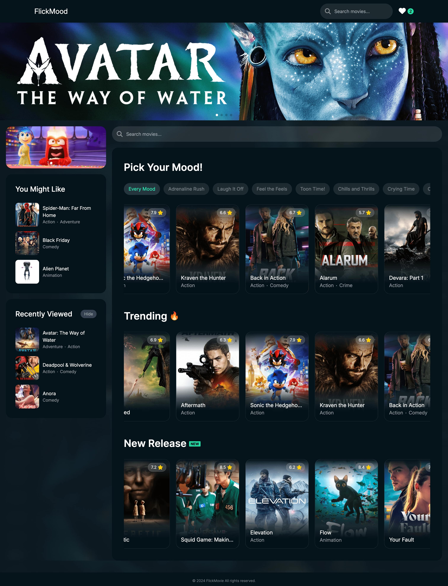

# FlickMood 🎥✨

FlickMood is a movie information and discovery web app that not only provides traditional features like trending and new release movie lists but also introduces a unique and fun way to explore movies based on moods. The app is designed to make movie selection enjoyable and personalized for users, offering detailed movie information and creative filtering options.



## 🚀 Features

### 🎭 Mood-Based Filtering
FlickMood introduces mood-based categories such as **"Crying Time," "Feel the Feels,"** and **"Adrenaline Rush,"** providing a more engaging way to discover movies beyond traditional genres.

### 🎬 Detailed Movie Information
Clicking on a movie provides:
- Movie overview and plot summary
- Cast details
- Official trailers
- User reviews
- Related movie recommendations

### 🔥 Trending and New Releases
Stay up-to-date with the latest trends and discover newly released movies through dedicated sections.

### ⭐ Favorites
Save your favorite movies using **Local Storage** and revisit them anytime without the need for an account.

---

## 🛠 Development Process

### 1️⃣ Frontend Development
- Built using **React.js** for its component-based architecture and seamless state management.
- Designed with **Tailwind CSS** to ensure a modern and responsive UI.

### 2️⃣ API Integration
- Utilized **The Movie Database (TMDb) API** to fetch movie details, trailers, cast information, and reviews.
- **Mood-based filtering challenge**: Since the API doesn't provide mood categories:
  - Movies were grouped by genre using the API data.
  - Genres were then mapped to custom mood-based categories (e.g., *Drama → "Crying Time"*, *Comedy → "Laugh It Off"*).

### 3️⃣ Local Storage Implementation
- Implemented a **Local Storage solution** for saving user favorites.
- Ensured that the saved data persisted across sessions, allowing users to build and access a **personalized list of movies**.

### 4️⃣ Dynamic and Engaging UI
- Developed a **clean and intuitive layout** featuring sections like *"Trending,"* *"New Release,"* and *"Pick Your Mood!"*
- Added **interactive components** like hover effects and responsive designs to enhance user experience.

---

## ⚡ Challenges & Solutions

### 🎭 Mood-Based Filtering
- The API does not provide predefined mood-based categories.
- Implemented **custom logic** to **map movie genres to mood-based labels**, creating a **more engaging and intuitive experience**.

### 💾 Local Storage Implementation
- Ensured **seamless updates** and **data persistence** across user sessions.
- Managed **state synchronization** between Local Storage and the UI for real-time updates.

---

## 💻 Tech Stack

- **Frontend**: React.js
- **Styling**: Tailwind CSS
- **API**: The Movie Database (TMDb) API
- **Storage**: Local Storage for user data persistence

---

## 🔧 Installation

1️⃣ **Clone the repository**:
```bash
git clone http://flickmood.sulnklm.com/
cd flickmood
npm install
npm start
